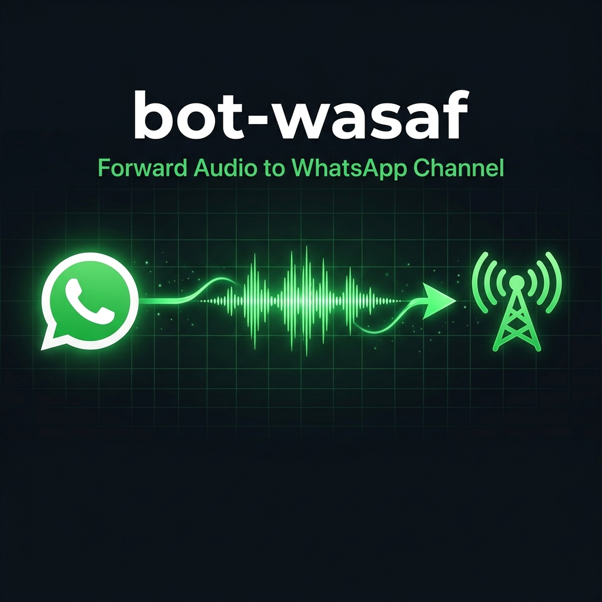

<div align="center">
  
</div>

<div align="center">

# bot-wasaf

**WhatsApp Bot — Forward Audio to Channel**

[](https://nodejs.org/)
[](https://github.com/fadzzzslebew/baileys)
[](https://pm2.keymetrics.io/)
[](https://ffmpeg.org/)
[](./LICENSE)

*A WhatsApp bot that automatically forwards incoming audio messages to a WhatsApp Channel (Newsletter) as a voice note.*

</div>

---

## Features

| Feature | Description |
|---|---|
| Auto Forward Audio | Receive audio, select a channel, bot sends it as a PTT voice note |
| Automatic Format Conversion | MP3, M4A, MP4, OGG, and all FFmpeg-supported formats are converted to OGG Opus |
| Multi-Channel Support | Choose from all WhatsApp Channels followed by the bot account |
| Owner Restriction | Restrict access to a specific number (optional) |
| Auto Read | Incoming messages are marked as read automatically |
| Auto Reconnect | Automatically reconnects if the connection drops |
| PM2 Ready | Production-ready deployment with PM2 and ecosystem config |
| Structured Logging | Formatted timestamped logs for easy monitoring |

---

## Packages

### Dependencies

| Package | Version | Purpose |
|---|---|---|
| [`@fadzzzslebew/baileys`](https://github.com/fadzzzslebew/baileys) | `^0.1.1` | WhatsApp Web API library — connection, messaging, and channel management |
| [`fluent-ffmpeg`](https://github.com/fluent-ffmpeg/node-fluent-ffmpeg) | `^2.1.3` | Node.js FFmpeg wrapper — converts audio to OGG Opus format |
| [`ffmpeg-static`](https://github.com/eugeneware/ffmpeg-static) | `^5.3.0` | Bundled FFmpeg binary — no manual FFmpeg installation required on the server |
| [`qrcode-terminal`](https://github.com/gtanner/qrcode-terminal) | `^0.12.0` | Renders the QR code directly in the terminal during first-time login |

### Global Tools

| Tool | Purpose |
|---|---|
| [PM2](https://pm2.keymetrics.io/) | Node.js process manager — auto restart, logging, and startup on boot |
| [Node.js >= 20.x](https://nodejs.org/) | JavaScript runtime |

---

## Project Structure

```
bot-wa-forward-audio-channel/
│
├── index.js                 Entry point — main bot logic
├── ecosystem.config.js      PM2 configuration
├── config.json              Bot configuration (gitignored)
├── package.json             npm manifest and scripts
│
├── auth_info_baileys/       WhatsApp session files (auto-generated, gitignored)
│   ├── creds.json
│   └── *.json
│
└── assets/
    └── banner.png
```

---

## How It Works

```
User sends an audio message or voice note
       |
       v
Bot downloads the audio
       |
       v
Is the format OGG/Opus?
       |  No  --> FFmpeg converts to OGG Opus
       |  Yes --> continue
       v
Bot sends a numbered list of followed channels
       |
       v
User replies with a number
       |
       v
Bot forwards the audio to the selected channel as a PTT voice note
```

---

## Installation

### 1. Clone the Repository

```bash
git clone https://github.com/Tianndev/bot-wa-forward-audio-channel.git
cd bot-wa-forward-audio-channel
```

### 2. Install Dependencies

```bash
npm install
```

No manual FFmpeg installation is needed — it is bundled via `ffmpeg-static`.

### 3. Configure the Bot

Create or edit `config.json`:

```json
{
  "ownerNumber": "628xxxxxxxxxx"
}
```

| Field | Type | Required | Description |
|---|---|---|---|
| `ownerNumber` | `string` | No | The WhatsApp number allowed to use the bot (format: `628xxx`). Leave empty `""` to allow everyone. |

### 4. First-Time Login (QR Scan)

```bash
node index.js
```

Scan the QR code shown in the terminal using **WhatsApp > Linked Devices > Link a Device**.

Once connected, press `Ctrl+C`. The session is saved to `auth_info_baileys/`.

### 5. Run with PM2

```bash
npm run pm2:start
pm2 save
pm2 startup
```

Follow the instructions printed by `pm2 startup` to enable auto-start on server reboot.

---

## Usage

Send an audio file or voice note to the bot number, then follow the prompts:

```
User  ->  [voice note / audio file]

Bot   ->  Select target channel:

          1. News Channel
          2. Music Channel
          3. Daily Podcast

          Reply with a number.

User  ->  2

Bot   ->  Audio successfully sent to "Music Channel".
```

> Make sure the bot's WhatsApp account follows at least one WhatsApp Channel before use.

---

## Deployment (VPS / aaPanel)

### Server Requirements

```bash
curl -fsSL https://deb.nodesource.com/setup_20.x | sudo -E bash -
sudo apt-get install -y nodejs

npm install -g pm2
```

### Deploy Steps

```bash
git clone https://github.com/Tianndev/bot-wa-forward-audio-channel.git
cd bot-wa-forward-audio-channel
npm install

nano config.json

node index.js

pm2 start ecosystem.config.js
pm2 save
pm2 startup
```

---

## PM2 Commands

| Command | Description |
|---|---|
| `npm run pm2:start` | Start the bot via PM2 |
| `npm run pm2:stop` | Stop the bot |
| `npm run pm2:restart` | Restart the bot |
| `npm run pm2:logs` | Stream live logs |
| `npm run pm2:delete` | Remove from PM2 |
| `pm2 status` | View all running processes |

---

## Log Format

The bot outputs structured logs to stdout:

```
[HH:MM:SS] LEVEL | key=value
```

Example output:

```log
[01:10:00] BOOT      | connecting...
[01:10:03] QR        | scan to connect
[01:10:15] CONNECTED | name=BotName | number=628xxx
[01:10:16] CHANNEL 1 | News Channel | 120363xxx@newsletter
[01:10:17] CHANNEL 2 | Music Channel | 120363yyy@newsletter
[01:11:00] AUDIO     | from=628yyy@s.whatsapp.net | mime=audio/mpeg | downloading...
[01:11:01] CONVERT   | from=audio/mpeg to ogg/opus
[01:11:02] PENDING   | from=628yyy@s.whatsapp.net | waiting for channel selection
[01:11:05] FORWARD   | success | target=120363xxx@newsletter
[01:12:00] DISCONNECT| code=408 | reconnect=true
[01:12:05] BOOT      | connecting...
```

---

## Security

> [!WARNING]
> Never commit the `auth_info_baileys/` folder. It contains your WhatsApp session credentials and is excluded by `.gitignore` by default.

> [!WARNING]
> Never commit `config.json` to a public repository. It contains a private phone number and is excluded by `.gitignore` by default.

> [!NOTE]
> If the bot is logged out, delete the `auth_info_baileys/` directory and re-run `node index.js` to scan a new QR code.

> [!NOTE]
> Audio is held in memory temporarily during the channel selection phase and is cleared immediately after forwarding. No audio files are written to disk.

---

## Troubleshooting

| Issue | Solution |
|---|---|
| No channels listed | Make sure the bot's WA account follows at least one WhatsApp Channel |
| QR code does not appear | Delete `auth_info_baileys/` and restart |
| `Error: download failed` | Check internet connection and restart the bot |
| Bot does not respond to audio | Verify `ownerNumber` in `config.json` or leave it empty to allow all |
| Audio conversion fails | Ensure `npm install` completed without errors |
| PM2 does not auto-start on reboot | Run `pm2 startup` and follow the printed instructions |

---

## Supported Audio Formats

| Format | Extension | Notes |
|---|---|---|
| OGG Opus | `.ogg` | Native WhatsApp PTT format — no conversion needed |
| MP3 | `.mp3` | MPEG Audio Layer III |
| MP4 Audio | `.mp4`, `.m4a` | AAC / audio container |
| WAV | `.wav` | Waveform Audio |
| FLAC | `.flac` | Lossless audio |
| AAC | `.aac` | Advanced Audio Coding |
| All FFmpeg formats | — | Any format supported by FFmpeg |

---

## License

This project is licensed under the **MIT License**.

---

<div align="center">

Made by [Tianndev](https://github.com/Tianndev) — powered by [Baileys](https://github.com/fadzzzslebew/baileys) and [FFmpeg](https://ffmpeg.org/)

</div>
